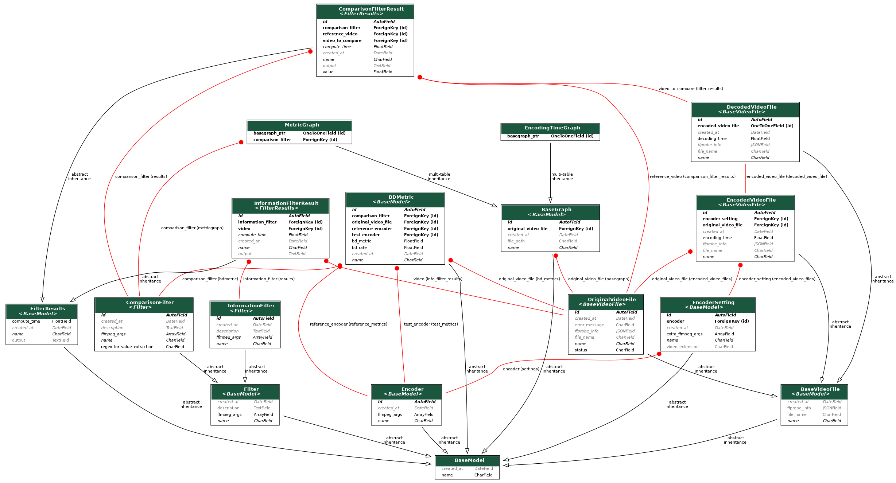

# Video encoding app

---

Web app used for video encoding and comparing the performance of different video software encoders.

The application uses `ffmpeg` and `ffprobe` for all video related operations (encoding, computing metrics, extracting metadata).

---

## Useful commands:

Run the app (then access the application by navigating at http://localhost:8000):

    docker compose up

Run test suite:

    docker compose run --rm test pytest tests/

Create a superuser for Django's admin site (use the following command and follow the instructions):

    docker compose run --rm web python manage.py createsuperuser

Manually run pre-commit hooks for linting and auto-formatting code:

    ./scripts/run_code_checks.sh

----

## Usage

In order to start a new video encoding experiment or examine previous results, navigate at http://localhost:8000/console/home.

By default, the app offers support for a few software encoders and metrics, but it can work with any encoders and metrics that ffmpeg supports.
The apps functionality can be extended by creating new `Codec`, `EncoderSetting`, `InformationFilter`, and `ComparisonFilter` instances in Django's admin site (http://localhost:8000/admin).

---

## Model diagram

